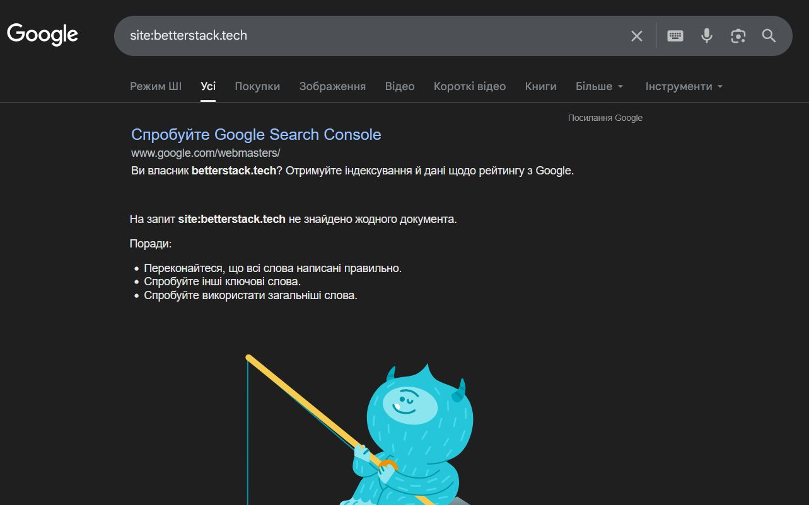
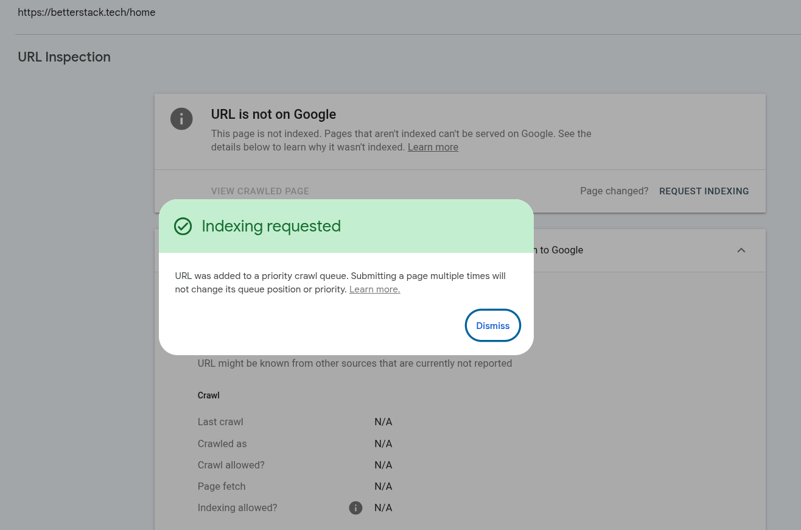

## Опис сайту
betterstack це сайт де можна порівнювати різне програмне забезпечення для розробників. Сайт здійснює порівняння на основі метрик та факторів і видає diff двох софтів. Також сайт формує статтю про софт яка засновується на його даних і описі, написаного в форматі markdown.

## Url Сайту:
https://betterstack.tech/home

## Результати перевірки ключових елементів через curl.txt

### Аналіз результату

| Елемент | Присутність | Вміст / Опис |
| --- | :---: | --- |
| **Текст статей** | **Ні** | Повний текст статей відсутній; наявні лише картки-прев'ю програмного забезпечення. |
| **`<title>`** | **Так** | Home &#124; betterstack |
| **`<meta name="description">`** | **Так** | `View and choose the best software.` |
---

### Body

### Навігація та заголовок

* **Заголовок сторінки (H1)**: «Find the perfect stack».

* **Пошук**: Інтерактивне поле «Search software or frameworks...».
* **Populare Software**: Список популярних програмного забезпечення. (Jet Brains Rider, Visual Studio Code та Vim)

### View Source в браузері
Ідентичний (файл view-source.html)

## Google Cache перевірка

## Підключення Google Search Console

### Запит на індексацію головної сторінки

