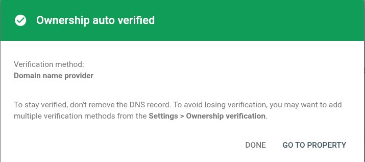

# Лабораторна робота №1. Вступ до SEO та пошукових систем

## Хід роботи

### 1. Розробка MVP

Розроблено систему "betterstack" -- каталог ПЗ (Софту), яке зачасту
використовується програмістами.

Софт може належати до 1+ Категорій. Кожна категорія визначає набір факторів, що
можуть бути притаманні відповідному Софту, та набір метрик, за якими можна
порівняти два екземпляри Софту одної категорії. При додаванні Софту до системи,
Адмін може додати опис у форматі Markdown.

Системою передюачено три типи користувачів:
- Незареєстрований (Гість)
- Зареєстрований (Юзер)
- Адміністратор (Адмін)

Гість може:
- Переглянути вибірку найвживанішого Софту
- Переглянути Софт за обраною категорією
- Переглянути детальну інформацію про Софт
- Порівняти два екземпляри Софту, що належать одній категорії

Юзер може:
- Усе, що й Гість
- Увійти у систему за email та паролем
- Позначити Софт, як такий, що використовувався користувачем (aka вподобайка)

Адмін може:
- Усе, що й Юзер
- СRUD Софту
- CRUD Категорій
- CRUD факторів та метрик
- Надати користувачеві права адміністратора

### 2. Розгортання на хостингу

У якості хостингу використано [Digital Ocean](https://www.digitalocean.com/).

### 3. Реєстрація домену

Було роздобуто домен [betterstack.tech](betterstack.tech).

### 4. Підключення домену до хостингу

Із контрольної панелі управління DNS було налаштовано CNAME записи для
переспрямування на IP сервісів на хостингу.

Сайт доступний тут 👉 [betterstack.tech](betterstack.tech).

### 5. "Що бачить Google?"


#### 5.1-2 Аналіз результату `curl`

```
curl https://betterstack.tech | htmlq -p > curl-result.html
```

Результат записаний у [curl-result.html](./curl-result.html).

| Елемент | Присутність | Вміст / Опис |
| --- | :---: | --- |
| **Текст статей** | **Ні** | Повний текст статей відсутній; наявні лише картки-прев'ю програмного забезпечення. |
| **`<title>`** | **Так** | Home &#124; betterstack |
| **`<meta name="description">`** | **Так** | `View and choose the best software.` |

Вміст `<body>`:

* **Заголовок сторінки (`<h1>`)**: "Find the perfect stack".
* **Пошук**: Інтерактивне поле "Search software or frameworks...".
* **Populare Software**: Список популярних Софту: Vim, Jet Brains Rider та PostgreSQL

#### 5.3 View Source в браузері

Зміст ідентичний результату виконання `curl`.

```
xclip -selection clipboard -o | htmlq -p > view-source.html
```

```bash
$ sha256sum *.html

c984100c08ad74c850dff1d3faf490e0102a2577b472067aa29e39ee597f7ff5  curl-result.html
c984100c08ad74c850dff1d3faf490e0102a2577b472067aa29e39ee597f7ff5  view-source.html
```

#### 5.4 Google Cache перевірка


### 6. Підключення Google Search Console



### 7. Запит на індексацію головної сторінки


