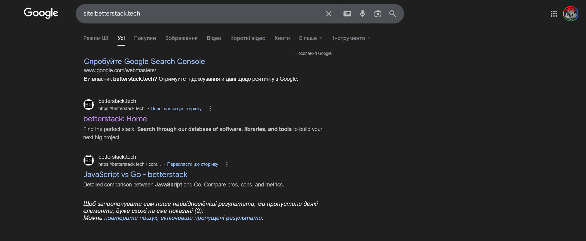

# Лабораторна робота №2. Індексація та алгоритми Google

## Хід роботи

### 1. Перевірка поточного стану індексації

#### 1.1 - URL Inspection у GSC

Статус індексації: ✅ Indexed

Дата останнього crawl: `Mar 19, 2026, 4:18:19 PM`

Метод виявлення URL:
* Sitemaps: "No referring sitemaps detected"
* Referring page: "https://betterstack.tech/home"

Чи дозволено індексацію robots.txt (Crawl allowed?): Yes

Canonical:
* User-declared: None
* Google-selected: "Inspected URL"

Статус рендерингу: 👉 [screenshot](./media/crawl-screenshot_homepage.png)

- Зробити скріншот вкладки **"Coverage"** та **"Enhancements"**

#### 1.2 - Перевірка через пошукові оператори

Виконати наступні запити в Google та зафіксувати результати:

```
site:ваш-домен.pp.ua
cache:ваш-домен.pp.ua
info:ваш-домен.pp.ua
```

| Оператор | Результат | Що це означає |
|----------|-----------|---------------|
| site:    |           |       Індексація пішла. Google вже "проковтнув"  структуру. Те, що вилізла сторінка порівняння — хороший знак, значить динамічні роути працюють правильно.        |
| cache:   |   Нічого        |       Сторінка ще "свіжа". Googlebot бачив сайт, але ще не зберіг його копію у себе в пам'яті (кєші). Це нормально для нових сайтів або тих, що часто оновлюються.        |
| info:    |   Інші сайти з аналогічним доменом    |   Низька унікальність домену. Для Google адреса поки що виглядає як частина "загального пулу" безкоштовних піддоменів.            |

> **Очікуваний результат:** сайт може ще не з'явитись у результатах - це нормально для нового домену. Важливо
> зафіксувати поточний стан і розуміти чому так відбувається.

#### 1.3 - Аналіз статусів Coverage Report

Нижче наведено типові статуси які можна побачити у GSC Coverage Report. Для кожного статусу - напишіть пояснення своїми
словами та вкажіть можливу причину:

| Статус                                 | Пояснення | Можлива причина |
|----------------------------------------|-----------|-----------------|
| **Submitted and indexed**              |           |                 |
| **Crawled - currently not indexed**    |           |                 |
| **Discovered - currently not indexed** |           |                 |
| **Excluded by noindex tag**            |           |                 |
| **Blocked by robots.txt**              |           |                 |
| **Redirect error**                     |           |                 |
| **404 Not Found**                      |           |                 |
| **Soft 404**                           |           |                 |

> [Документація GSC](https://support.google.com/webmasters/answer/7440203) для дослідження кожного статусу

---

### 2. Аналіз алгоритмів Google на реальних прикладах

Для кожного алгоритму знайти реальний кейс (новина, кейс-стаді, форум) де сайт постраждав або виграв після оновлення.
Заповніть таблицю:


| Алгоритм | Рік запуску | На що впливає | Реальний кейс (посилання/приклад) | Що треба робити |
| :--- | :--- | :--- | :--- | :--- |
| **Panda** | 2011 | Якість контенту: бореться з плагіатом, "тонким" (thin) контентом та спамом. | [Кейс EzineArticles](https://searchengineland.com/google-panda-two-years-later-losers-still-losing-one-real-recovery-149491): Сайт втратив 90% трафіку через низькоякісні статті. | Створювати унікальний, глибокий контент. Видалити або об'єднати сторінки з 200-300 словами ні про що. |
| **Penguin** | 2012 (v3.0 у 2014) | Боротьба з "неприродними" посиланнями та переоптимізацією анкорів. Оновлення 3.0 підтвердило, що алгоритм працює як циклічний фільтр: сайти, що потрапили під санкції, не зможуть відновитися до наступного апдейту, навіть якщо виправлять помилки. | [Аналіз Penguin 3.0 від CognitiveSEO](https://cognitiveseo.com/blog/6741/google-penguin-3-0-recoveries-and-penalties-analysis/): Доведено, що для відновлення позицій недостатньо просто видалити погані лінки — необхідна повна чистка профілю через Disavow Tool та заміна спаму якісними, релевантними посиланнями. | Проводити глибокий аудит (link pruning) перед кожним оновленням. Дотримуватися балансу анкор-листа (мінімізувати "exact match"). Фокусуватися на авторитетності та тематичній близькості донорів, а не на їх кількості. |
| **BERT** | 2019 | Прорив у **Natural Language Processing (NLP)**. На відміну від старих алгоритмів, що читали слова по черзі, BERT аналізує контекст слова відносно **всіх** інших слів у реченні (двонаправленість). Це дозволяє Google розуміти дрібні нюанси та значення прийменників (наприклад, "для", "до", "з"). | [Офіційний приклад Google](https://blog.google/products/search/search-language-understanding-bert/): Запит *"2019 brazil traveler to usa need a visa"*. Раніше Google ігнорував прийменник **"to"** і видавав інфу для американців у Бразилії. BERT зрозумів інтент: людина їде **в** США, і видав сторінку посольства. | Немає сенсу "підганяти" текст під ключі. Потрібно створювати контент, який максимально точно відповідає на конкретний **user intent** (намір). Писати природною мовою, враховуючи, що Google тепер розуміє складні розмовні конструкції. |

### Який алгоритм найбільш релевантний для BetterStack?

Для сайту **betterstack.tech** найбільш релевантним є **BERT** (і загалом оновлення типу Helpful Content Update, що базуються на принципах BERT).

**Чому?**
BetterStack — це технічний ресурс (guides, documentation, community posts). Технічні фахівці шукають відповіді на дуже конкретні, складні запити (наприклад, *"how to handle logs in kubernetes with vector"*).

  * **Контекст — це все:** BERT допомагає Google зрозуміти нюанси між схожими термінами в програмуванні.
  * **Експертність:** Для таких сайтів важливо не просто мати ключові слова, а давати точну відповідь на інтент розробника. Якщо розробник шукає рішення проблеми, BERT допоможе вашій статті бути в топі, якщо вона справді пояснює "як", а не просто містить слова "log management".

-----

### Як BERT змінив підхід до написання контенту порівняно з Panda?

Різниця між ними — це еволюція від "не будь поганим" до "будь корисним".

1.  **Відмова від "щільності ключових слів":**

      * **За часів Panda:** Копірайтери намагалися вставити ключове слово "DevOps tools" 5 разів на 1000 слів, щоб алгоритм зрозумів тему і не вважав текст спамом.
      * **З BERT:** Ви можете взагалі не використовувати точне входження ключа, якщо ваш текст описує інструменти автоматизації та інфраструктуру як код. Google зрозуміє семантику.

2.  **Фокус на структурі та інтенті:**

      * **Panda** змусила нас писати довгі тексти (бо короткі — це "thin content").
      * **BERT** каже: "Довжина не має значення, якщо користувач отримав відповідь". Тепер контент пишеться під конкретні питання (Long-tail queries).

3.  **Природність мови:**

      * **Panda** вимагала відсутності помилок і унікальності.
      * **BERT** вимагає, щоб текст читався як професійна порада колеги. Використання специфічного сленгу (який розуміє BERT) тепер допомагає ранжуванню, бо це маркер експертності.
---

### 3. Впровадження E-E-A-T у проєкт

E-E-A-T (Experience, Expertise, Authoritativeness, Trustworthiness) - це набір сигналів якими Google оцінює якість та
надійність сайту. Завдання: впровадити конкретні E-E-A-T елементи у проєкт.

#### 3.1 - Сторінка "Про нас" `/about`

Створити та наповнити сторінку `/about` яка містить:

- Назва та опис блогу (чим займається, для кого)
- Місія або редакційна політика
- Контактна інформація (email або форма)
- Посилання на соцмережі проєкту
- Дата заснування

#### 3.2 - Профілі авторів

Для кожного автора в базі даних заповнити:

- Повне ім'я (не нікнейм)
- Фото або аватар
- Коротка біографія (2-3 речення про експертизу)
- Посилання на LinkedIn або GitHub
- Кількість опублікованих статей

Переконатись що сторінка `/authors/[slug]` відображає всі ці дані.

#### 3.3 - Підпис автора на сторінці статті

На сторінці `/articles/[slug]` додати блок автора який містить:

- Фото автора
- Ім'я з посиланням на `/authors/[slug]`
- Коротке bio (1-2 речення)
- Дата публікації та дата останнього оновлення

#### 3.4 - E-E-A-T чек-ліст

Після виконання завдань заповнити чек-ліст:

**Experience (Досвід)**

- Статті написані від першої особи або містять особистий досвід
- Є конкретні приклади, скріншоти, кейси

**Expertise (Експертиза)**

- Профіль автора підтверджує компетентність у темі
- Статті містять технічно точну інформацію
- Є посилання на авторитетні джерела

**Authoritativeness (Авторитетність)**

- Сторінка `/about` з описом редакції
- Автори мають публічні профілі (LinkedIn/GitHub)
- Наявні зовнішні посилання на сайт (backlinks)

**Trustworthiness (Надійність)**

- Сайт працює через HTTPS
- Є контактна інформація
- Дати публікацій відображаються коректно
- Немає битих посилань

---

### 4. Базовий Lighthouse звіт

Цей крок фіксує **поточний стан** продуктивності сайту до будь-якої оптимізації. Ці дані будуть точкою порівняння в
майбутніх лабораторних.

#### 4.1 - Запустити PageSpeed Insights

- Перейти на [pagespeed.web.dev](https://pagespeed.web.dev)
- Ввести URL головної сторінки сайту
- Запустити аналіз для **Mobile** та **Desktop**

#### 4.2 - Зафіксувати показники

| Метрика                             | Mobile | Desktop |
|-------------------------------------|--------|---------|
| Performance Score                   |        |         |
| SEO Score                           |        |         |
| Accessibility Score                 |        |         |
| Best Practices Score                |        |         |
| **LCP** (Largest Contentful Paint)  |        |         |
| **CLS** (Cumulative Layout Shift)   |        |         |
| **INP** (Interaction to Next Paint) |        |         |
| **FCP** (First Contentful Paint)    |        |         |
| **TTFB** (Time to First Byte)       |        |         |

#### 4.3 - Аналіз результатів

У звіті відповісти на питання:

1. Які метрики у червоній зоні? Що це означає для користувача?
2. Які три проблеми PageSpeed вважає найкритичнішими?
3. Порівняй результати Mobile vs Desktop - чому вони відрізняються?

> **Важливо:** не намагайся виправляти проблеми зараз. Мета - зрозуміти поточний стан. Оптимізація буде в наступних
> лабораторних роботах.

---

### Результати для звіту

```
1. Скріншот URL Inspection з GSC (головна сторінка)
2. Результати site:, cache:, info: операторів
3. Заповнена таблиця статусів Coverage Report з поясненнями
4. Таблиця алгоритмів Google з реальними кейсами
5. Скріншот сторінки /about
6. Скріншот профілю автора на сторінці статті
7. Заповнений E-E-A-T  чек-ліст
8. Скріншоти PageSpeed Insights (Mobile + Desktop)
9. Заповнена таблиця Lighthouse метрик
10. Аналіз результатів Lighthouse
```

---

## Контрольні питання

### Рівень 1 - Розуміння термінів

1. Що означає статус "Discovered - currently not indexed" і чому Google може не індексувати сторінку навіть якщо знайшов
   її?
2. Яка різниця між `crawling` та `indexing`? Чи може сторінка бути crawled, але не indexed?
3. Що таке "crawl budget" і чому він важливий для великих сайтів?
4. Поясніть що означає кожна літера в абревіатурі E-E-A-T.
5. Що таке LCP, CLS та INP? Які порогові значення вважаються "оптимальними"?

### Рівень 2 - Аналіз

6. Алгоритм Panda карає за "thin content". Наведіть три приклади thin content який міг би з'явитись на вашому сайті та
   пояснити як його уникнути.
7. Чому алгоритм BERT змінив підхід до keyword stuffing? Як він аналізує текст інакше ніж попередні алгоритми?
8. Ваш сайт отримав низький Performance Score на мобільному пристрої. Назвіть три найпоширеніші причини цього і як їх
   виправити.
9. Чому Google надає перевагу сайтам з чітко вираженим авторством? Як це пов'язано з алгоритмом Helpful Content?
10. Що таке "Soft 404" і чим він небезпечніший за звичайний 404 з точки зору SEO?

### Рівень 3 - Синтез та висновки

11. Проаналізуйте свій E-E-A-T чек-ліст. Які три найслабші місця вашого проекту з точки зору E-E-A-T? Запропонуйте план
    покращення.
12. Уявіть, що після оновлення Helpful Content ваш сайт втратив 40% трафіку. Які кроки ви зробите для діагностики та
    відновлення позицій?
13. Порівняйте Lighthouse показники вашого сайту з показниками відомого IT-блогу, порталу тощо (наприклад css-tricks.com
    або dev.to). Що
    відрізняється і чому?
14. Які з Core Web Vitals метрик безпосередньо впливають на ранжування в Google і які лише рекомендовані? Знайдіть
    офіційне підтвердження вашої відповіді.

---

## Критерії оцінювання

| Завдання                               | Балів  |
|----------------------------------------|--------|
| URL Inspection + таблиця параметрів    | 1      |
| Аналіз Coverage Report статусів        | 2      |
| Таблиця алгоритмів з реальними кейсами | 2      |
| Сторінка /about створена та наповнена  | 1      |
| Профіль автора на сторінці статті      | 1      |
| E-E-A-T чек-ліст заповнений            | 1      |
| Lighthouse звіт + аналіз               | 2      |
| **Разом**                              | **10** |
