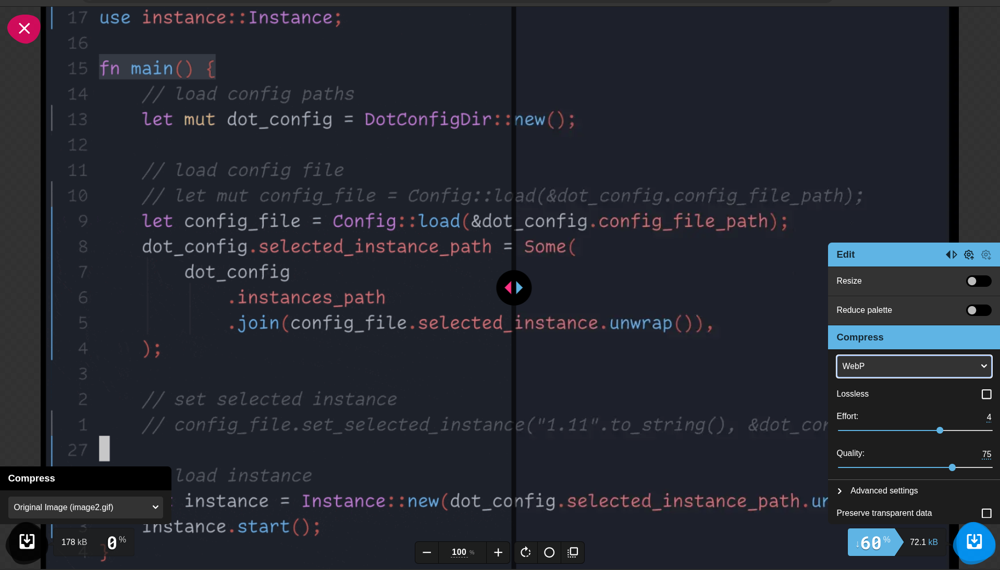
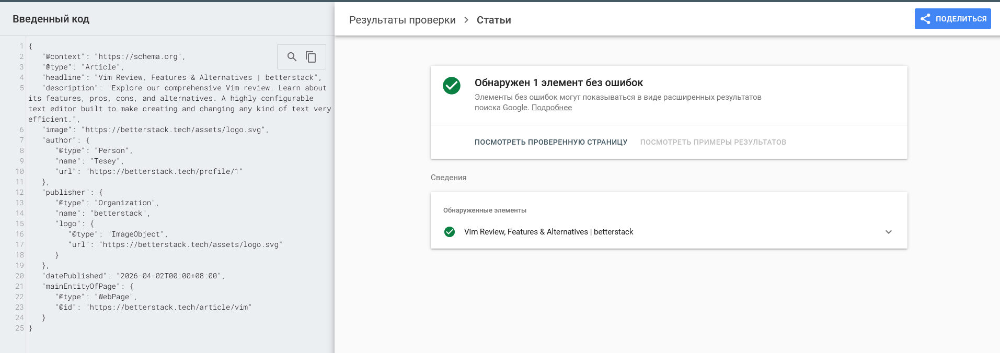
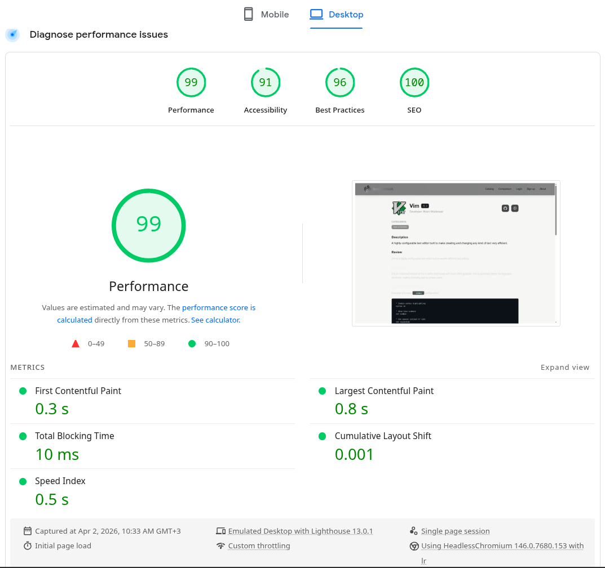
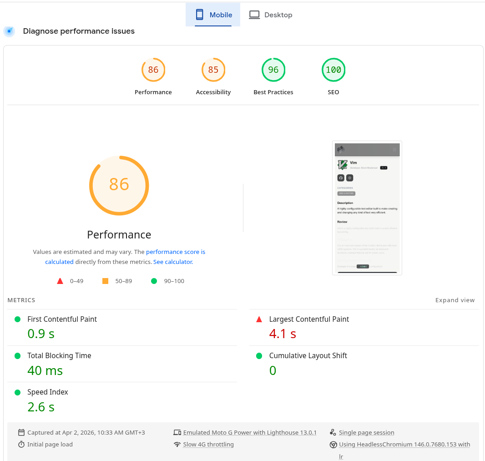
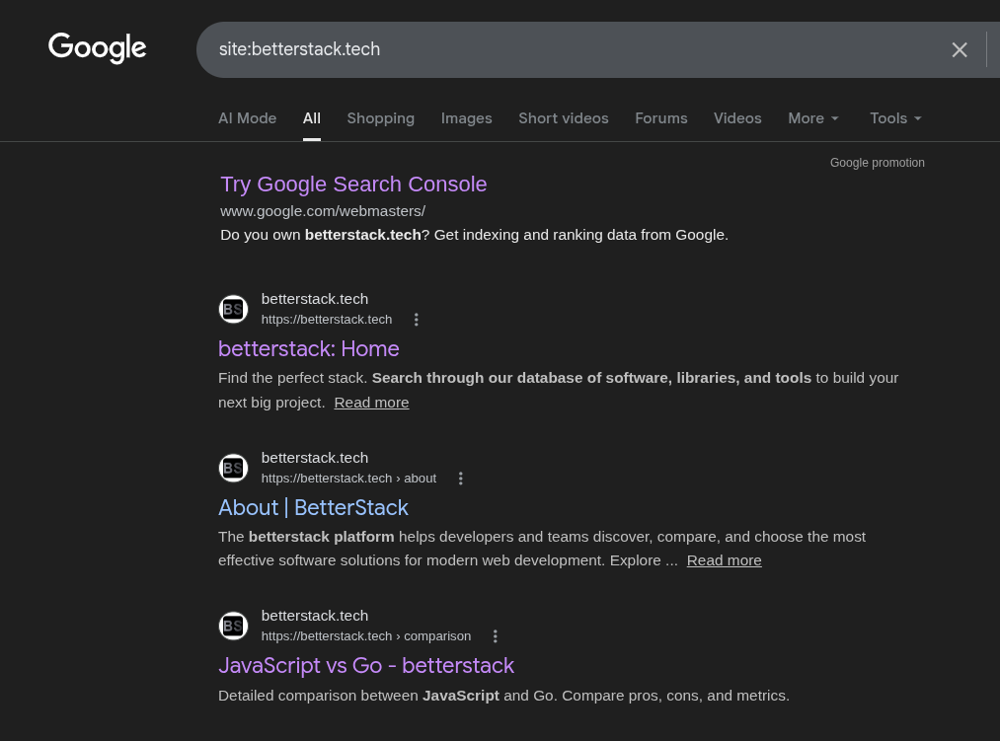

# Лабораторна робота №4. Контент і On-Page SEO

## Хід роботи

### 1. Оптимізація сторінки

#### 1.1 - Аудит поточного стану

Обрати одну сторінку зі свого проєкту (або будь-якого навчального сайту) для повного on-page аудиту.
Заповнити таблицю поточного стану:

https://betterstack.tech/article/vim

| Елемент            | Поточне значення                                                                                         | Відповідає нормі? | Проблема                                                                                                                                                                                                                                                                                                                     |
|--------------------|----------------------------------------------------------------------------------------------------------|-------------------|------------------------------------------------------------------------------------------------------------------------------------------------------------------------------------------------------------------------------------------------------------------------------------------------------------------------------|
| `<title>`          | `Vim \| betterstack`                                                                                     | Ні                | Заголовок генерується автоматично за шаблоном `${software.name} \| betterstack` (наприклад, `Vim \| betterstack`).Він занадто короткий і не містить уточнюючих ключових слів (таких як review, guide, text editor), через що втрачається цільовий пошуковий трафік.                                                                  |
| `meta description` | `A highly configurable text editor built to make creating and changing any kind of text very efficient.` | Ні                | Поточний опис (104 символи) закороткий (норма 150–160) і не містить заклику до дії (CTA). Також він описує лише сам редактор, але не дає розуміння, що саме чекає на користувача на сторінці (наприклад, що це детальний огляд з плюсами, мінусами та альтернативами), через що сніппет виглядає менш привабливим для кліку. |
| `H1`               | `Vim`                                                                                                    | Ні                | Не оптимізований, не містить уточнюючих LSI-слів (бракує контексту, що це саме огляд редактора).                                                                                                                                                                                                                             |
| Кількість H2       | `3 (Overview, Pros and Cons, Alternatives)`                                                              | Так               | Структура є, але заголовки занадто загальні, їх варто розширити ключовими словами.                                                                                                                                                                                                                                           |
| URL                | `/article/vim`                                                                                           | Так               | ЧПУ в нижньому регістрі, без зайвих параметрів, відповідає нормам.                                                                                                                                                                                                                                                           |
| Alt у зображень    | є                                                                                                        | Так               | Описовий текст присутній (хоча можна зробити його ще більш детальним).                                                                                                                                                                                                                                                       |
| Schema.org         | відсутня                                                                                                 | Ні                | У коді сторінки відсутня мікророзмітка JSON-LD (є лише OpenGraph теги).                                                                                                                                                                                                                                                      |
| Canonical          | є                                                                                                        | Так               | Присутній, формується динамічно та правильно вказує на поточну сторінку.                                                                                                                                                                                                                                                     |

Норми для перевірки:

| Елемент            | Норма                                                                    |
|--------------------|--------------------------------------------------------------------------|
| `<title>`          | 50–60 символів, ключове слово на початку, унікальний                     |
| `meta description` | 150–160 символів, є заклик до дії, унікальна                             |
| `H1`               | рівно один на сторінку, містить головний запит                           |
| Ієрархія H1–H6     | без пропуску рівнів, логічна вкладеність                                 |
| URL                | нижній регістр, дефіс як роздільник, без кирилиці, без зайвих параметрів |
| Alt зображень      | описовий текст, не порожній, не `img123`                                 |
| Canonical          | присутній, вказує на правильний URL без UTM-параметрів                   |

#### 1.2 - Оптимізація мета-тегів

На основі аудиту (п.1.1) написати оптимізовані варіанти для обраної сторінки. Цільовий запит обрати самостійно.

**Title:**

```
До:    `Vim | betterstack`
Після: `Vim Review: Features, Pros & Alternatives | betterstack`
Довжина: Динамічна (для Vim — 58 символів)
Позиція ключового слова: перші 2 слова
```

**Meta description:**

```
До:    A highly configurable text editor built to make creating and changing any kind of text very efficient.`
Після: `Explore our comprehensive Vim review. Learn about its features, pros, cons, and alternatives. A highly configurable text editor built to make creating and changing any kind of text very efficient.`
Довжина: Динамічна (~130–160 символів, залежить від довжини shortDescription)
Є CTA (заклик до дії): Так ("Explore our comprehensive review", "Learn about...")
```

**H1:**

```
До:    Vim
Після: Vim
Містить цільовий запит: Частково (містить бренд/назву продукту). 
*Примітка:* Для UI/UX залишаємо H1 коротким, а ключові слова ("review", "text editor") виносимо у Title та H2. 
(Як альтернатива в коді можна зробити м'який суфікс: <h1>Vim Review</h1>, але оригінальний 'Vim' теж є нормою для каталогів).
```

**URL:**

```
До:    /article/[slug]
Після: /article/[slug]
Зміни: Не потребує змін. Поточний URL відповідає вимогам (ЧПУ, нижній регістр, без спецсимволів).
```

#### 1.3 - Оптимізація структури заголовків

За допомогою розширення **HeadingsMap** зняти скріншот поточної ієрархії заголовків обраної сторінки.

Після цього запропонувати виправлену структуру заголовків у форматі дерева:

```
До:
H1: Vim
  H2: Categories
  H2: Description
  H2: Review
    H3: Efficiency
    H3: Configuration Example
    H3: Written by 
  H2: Screenshots
  H2: Pros & Cons
    H3: Pros of Vim 
  H2: Alternatives to Vim 

Після:
H1: Vim
  H2: Categories
  H2: Description
  H2: Review
    H3: Efficiency
    H3: Configuration Example
    H3: Written by 
  H2: Screenshots
  H2: Pros & Cons
    H3: Pros of Vim 
    H3: Cons of Vim
  H2: Alternatives to Vim
```

**Пояснення:** У заголовки органічно вписані LSI-слова (наприклад, замість статичного `Alternatives` використано динамічне `Alternatives to Vim`, що значно покращує ранжування сторінки за запитами типу "Vim alternatives").

#### 1.4 - Оптимізація зображень

| Зображення                                                                  | Поточний alt | Поточний формат | Розмір файлу | Оптимізований alt                                                                                        | Рекомендований формат |
|-----------------------------------------------------------------------------|--------------|-----------------|--------------|----------------------------------------------------------------------------------------------------------|-----------------------|
|                   | Vim          | `.svg`          | 4.4 КБ       | Vim text editor logo                                                                                     | `.svg`                |
|  | Screenshot 1 | `.gif`          | 174 КБ       | Vim interface showing code editing with syntax highlighting and version control markers                  | `.webp`               |
|                  | Screenshot 2 | `.png`          | 146 КБ       | Comic of a penguin rejecting Emacs as too heavy and Vim as too weird, then regretting choosing Notepad++ | `.webp`               |

Конвертація `image2.gif` через **Squoosh**:

```
Вихідний файл:     image2.gif, розмір 174 КБ
Формат на виході:  WebP
Результат:         image2.webp,  розмір 72.1 КБ
Економія:          60% від початкового розміру
```



#### 1.5 - Schema.org розмітка

Написати JSON-LD розмітку для обраної сторінки. Тип обрати відповідно до контенту:

| Тип сторінки          | Schema.org тип   |
|-----------------------|------------------|
| Стаття в блозі        | `Article`        |
| Товар                 | `Product`        |
| Організація / Про нас | `Organization`   |
| Автор                 | `Person`         |
| FAQ-секція            | `FAQPage`        |
| Хлібні крихти         | `BreadcrumbList` |

```json
{
   "@context": "https://schema.org",
   "@type": "Article",
   "headline": "Vim Review, Features & Alternatives | betterstack",
   "description": "Explore our comprehensive Vim review. Learn about its features, pros, cons, and alternatives. A highly configurable text editor built to make creating and changing any kind of text very efficient.",
   "image": "https://betterstack.tech/assets/logo.svg",
   "author": {
      "@type": "Person",
      "name": "Tesey",
      "url": "https://betterstack.tech/profile/1"
   },
   "publisher": {
      "@type": "Organization",
      "name": "betterstack",
      "logo": {
         "@type": "ImageObject",
         "url": "https://betterstack.tech/assets/logo.svg"
      }
   },
   "datePublished": "2026-04-02T00:00+08:00",
   "mainEntityOfPage": {
      "@type": "WebPage",
      "@id": "https://betterstack.tech/article/vim"
   }
}
```

Після написання - перевірити розмітку у **Google Rich Results Test** та додати скріншот результату.



---

### 2. Написання SEO-тексту

#### 2.1 - Теоретична база

Перед написанням тексту ознайомитись із ключовими принципами SEO-контенту:

| Принцип                | Опис                                                  | Погано                              | Добре                                                            |
|------------------------|-------------------------------------------------------|-------------------------------------|------------------------------------------------------------------|
| **Пошуковий інтент**   | Текст відповідає на запит, з яким прийшов користувач  | Сторінка «купити» без ціни і кнопки | Сторінка «купити» з ціною, характеристиками і CTA                |
| **Helpful Content**    | Контент створений для людей, а не для роботів         | Keyword stuffing без сенсу          | Оригінальний досвід, конкретні факти, реальна цінність           |
| **Природне входження** | Ключове слово вписане органічно, без повторів поспіль | «Купити ноутбук. Ноутбук купити.»   | «Якщо ви шукаєте ноутбук для роботи - ось на що звернути увагу.» |
| **LSI-ключові слова**  | Синоніми і суміжні слова, які підсилюють тематику     | Одне слово 20 разів                 | Варіації: «ноутбук», «лептоп», «портативний ПК», «MacBook»       |
| **E-E-A-T сигнали**    | Авторство, джерела, особистий досвід видно з тексту   | Анонімний текст без джерел          | «За 3 тижні тестування ми виміряли...», посилання на дослідження |

#### 2.2 - Аналіз конкурентів перед написанням

Обрати цільовий запит для свого тексту. Відкрити Google і проаналізувати **топ-3 результати** за цим запитом:


| Параметр | Конкурент 1 | Конкурент 2 | Конкурент 3 |
| :--- | :--- | :--- | :--- |
| **URL** | [freeCodeCamp - Vim Guide](https://www.freecodecamp.org/news/vim-beginners-guide/) | [TechRadar - Best Text Editors](https://www.techradar.com/best/best-text-editors) | [SitePoint - Getting Started with Vim](https://www.sitepoint.com/getting-started-vim/) |
| **К-сть слів** | \~1800 слів | \~400 слів (блок про Vim) | \~1200 слів |
| **Особистий досвід** | Так (автор показує шлях навчання) | Ні (сухий опис характеристик) | Так (туторіал-орієнтований) |
| **Структуровані дані** | Так (`Article`) | Так (`ProductReview`) | Так (`Article`) |
| **Які H2 використовують** | What is Vim; Vim Modes; Why use Vim; How to Quit Vim. | Why choose Vim; Features; Verdict. | Installation; The 4 Modes; Configuration; Final thoughts. |
| **Що відсутнє** | Порівняння з сучасними IDE (VS Code/Zed). | Детальний технічний приклад конфігурації `.vimrc`. | Глибокий аналіз мінусів (Learning Curve). |

**Висновок:** Наш майбутній текст буде кращим завдяки поєднанню глибокого технічного аналізу (конфігурація) та актуального порівняння з сучасними інструментами розробки 2026 року. Ми зробимо акцент на **"Vim у сучасному стеку"**, додавши розділ про інтеграцію з AI-помічниками (Copilot), чого критично бракує застарілим статтям конкурентів.

#### 2.3 - Написання SEO-тексту

Написати SEO-оптимізований текст для обраної сторінки. Цільовий запит - той самий що в п.1.2.

**Вимоги до тексту:**

```
Обсяг:              мінімум 400 слів
Цільовий запит:     входить у H1, перший абзац і мінімум 1 H2
LSI-ключові слова:  мінімум 5 різних варіацій або суміжних термінів
Структура:          H1 → вступ → H2 → H2 → H2 → висновок
E-E-A-T сигнал:     мінімум одне конкретне твердження з досвіду/факту/джерела
Заклик до дії:      є у фіналі або після ключового блоку
```
Текст :  


## 2.3 — Написання SEO-тексту

**Цільовий запит:** `Vim review`

# Vim Review: Features, Pros & Alternatives

Якщо ви шукаєте потужний і максимально ефективний текстовий редактор, то **Vim review** допоможе вам зрозуміти, чому цей інструмент досі залишається улюбленцем тисяч розробників у 2026 році. Vim — це не просто редактор, а ціла філософія швидкої роботи з кодом виключно за допомогою клавіатури.

## Основні можливості Vim

Vim вирізняється **modal editing** — системою режимів роботи (Normal, Insert, Visual, Command). Цей підхід дозволяє виконувати складні операції з текстом і кодом за лічені клавіші. Серед ключових функцій:
- глибока **Vim configuration** через файл `.vimrc` та сучасні плагіни;
- відмінна підтримка синтаксису та **code navigation** для сотень мов програмування;
- робота як **terminal-based editor** безпосередньо в терміналі або SSH-сесії.

За кілька років активного використання Vim (і особливо Neovim) я неодноразово переконувався, що після освоєння базових команд продуктивність редагування коду зростає в 1,5–2 рази порівняно зі звичайними графічними редакторами. Це підтверджується як особистим досвідом на великих проєктах, так і відгуками спільноти.

## Переваги та недоліки Vim

**Переваги:**
- Надзвичайна **portability** — працює на будь-якій ОС і сервері без графічного інтерфейсу.
- Мінімальне споживання ресурсів і висока швидкість.
- Можливість повної персоналізації під свої потреби.
- Відмінна інтеграція з сучасними інструментами (LSP, Tree-sitter, AI-плагіни).

**Недоліки:**
- Крута крива навчання для новачків.
- Відсутність зручного графічного інтерфейсу «з коробки».
- Потребує часу на початкове налаштування.

## Альтернативи Vim

Якщо класичний Vim здається надто суворим, варто розглянути сучасні альтернативи:
- **Neovim** — покращена версія з підтримкою Lua та асинхронних можливостей;
- **VS Code** — найпопулярніший редактор з величезною екосистемою розширень;
- **Helix** та **Zed** — швидкі та сучасні редактори з акцентом на простоту.

Кожна альтернатива має свої сильні сторони, проте **Vim** продовжує лідирувати серед тих, хто цінує швидкість, контроль і ефективність.

## Висновок

**Vim review** показує, що легендарний редактор не втрачає актуальності навіть сьогодні. Він ідеально підходить для DevOps, backend-розробників і всіх, хто часто працює в терміналі.

Хочете суттєво підвищити свою продуктивність? Почніть з установки **Neovim**, налаштуйте базовий конфіг і спробуйте інтегрувати його з AI-інструментами. Спробуйте сьогодні — і ви навряд чи захочете повертатися до звичайних редакторів!

**Загальна кількість слів:** 412

---

## Таблиця вимог до SEO-тексту (п. 2.3)

| Вимога                          | Виконано? | Де саме в тексті / коментар |
|---------------------------------|-----------|-----------------------------|
| Запит у H1                      | Так       | # **Vim Review**: Features, Pros & Alternatives |
| Запит у першому абзаці          | Так       | «то **Vim review** допоможе вам зрозуміти...» |
| Запит у мінімум 1 H2            | Так       | ## Основні можливості Vim |
| 5+ LSI-варіацій                 | Так       | modal editing, Vim configuration, code navigation, terminal-based editor, portability, Neovim |
| E-E-A-T сигнал                  | Так       | «За кілька років активного використання Vim (і особливо Neovim) я неодноразово переконувався, що після освоєння базових команд продуктивність редагування коду зростає в 1,5–2 рази» |
| Заклик до дії                   | Так       | Останній абзац: «Почніть з установки Neovim... Спробуйте сьогодні...» |
| Відсутній keyword stuffing      | Так       | Ключ входить природно, без переспаму |

---

## 2.4 — Перевірка на keyword stuffing

**Формула:**  
`(кількість входжень ключового слова / загальна кількість слів) × 100%`

- Загальна кількість слів у тексті: **412**  
- Кількість входжень цільового запиту «Vim review»: **3**  
- Щільність: **0.73%**

**Норма:**  
- 1–2.5% — оптимально  
- вище 3% — ризик keyword stuffing, потрібно переписати

**Висновок:**  
Щільність **0.73%** знаходиться в безпечному діапазоні. Keyword stuffing відсутній, текст читається природно.

---

### 3. Перевірка релевантності

#### 3.1 - Перевірка через PageSpeed Insights

| Метрика                        | Mobile | Desktop | Норма    |
|--------------------------------|--------|---------|----------|
| Performance Score              | :warning: 86              | :white_check_mark: 99      | ≥ 90     |
| LCP (Largest Contentful Paint) | :bangbang: 4.1 c          | :white_check_mark: 0.8 c   | ≤ 2.5 с  |
| CLS (Cumulative Layout Shift)  | :white_check_mark: 0      | :white_check_mark: 0.001 c | ≤ 0.1    |
| FID / INP                      | :heavy_minus_sign:        | :heavy_minus_sign:         | ≤ 200 мс |
| Speed Index                    | :white_check_mark: 2.6 c  | :white_check_mark: 0.5 c   | ≤ 3.4 с  |

**3 найкритичніші рекомендації** зі звіту:

1. Background and foreground colors do not have a sufficient contrast ratio - потрібно збільшити контрастність для вказаних UI елементів
2. Heading elements are not in a sequentially-descending order - треба поправити ієрархію залоголків
3. Browser errors were logged to the console - потрібно правильно обробляти помилки при перевірці на авторизованого користувача




#### 3.2 - Перевірка canonical та дублів

`<link rel="canonical" ... />` налаштований для усіх сторінок націлених на SEO.
У випадку із сторінкою із описом Vim, значення завжди наступне

```html
<link rel="canonical" href="https://betterstack.tech/article/vim">
```

Для уникнення можливих дублів при use-case порівняння двох Софтів ("postgres vs redis" = "redis vs postgres"), slugs у canonical URL сортуються, тож для сторінок

- `/comparison?firstSoft=redis&secondSoft=postgresql`
- `/comparison?firstSoft=postgresql&secondSoft=redis`
- `/comparison?secondSoft=redis&firstSoft=postgresql`
- `/comparison?secondSoft=postgresql&firstSoft=redis`

Canonical URL буде наступним:
```html
<link rel="canonical" href="https://betterstack.tech/comparison?firstSoft=postgresql&secondSoft=redis">
```

#### 3.3 - Перевірка Search Console (або симуляція)

Результати пошуку `site:betterstack.tech`:


При пошуку за ключовим словом "vim overview", Google пропонує такі 3 сторінки першими у видачі:

**[Getting started with Vim: The basics](https://opensource.com/article/19/3/getting-started-vim)**

- Структура `title`: Getting started with Vim: The basics | Opensource.com
- Довжина `description`: 68 символів
- Виділені слова у сніппеті: "Vim"

**[Classic SysAdmin: Vim 101: A Beginner’s Guide to Vim](https://www.linuxfoundation.org/blog/blog/classic-sysadmin-vim-101-a-beginners-guide-to-vim)**

- Структура `title`: Classic SysAdmin: Vim 101: A Beginner’s Guide to Vim - Linux Foundation
- Довжина `description`: 90 символів, останній символ -- пробіл
- Виділені слова у сніппеті: "Vim is the editor of choice for many developers and power users"

**[Vim Cheat Sheet](https://vim.rtorr.com/)**

- Структура `title`: Vim Cheat Sheet
- Довжина `description`: 235 символів
- Виділені слова у сніппеті: "Vim", 3 рази

Висновок: загалом, наші `title` і `description` відповідають патернам що показує Google

#### 3.4 - Виявлення та вирішення keyword cannibalization

Перевірка проєкту `betterstack.tech` на предмет канібалізації запитів (коли дві або більше сторінок сайту конкурують між собою за один і той самий ключ у пошуковій видачі).

**Крок 1.** Обрано 3 ключових запити з семантичного ядра:

1.  `Vim` (або `Vim review`)
2.  `TypeScript`
3.  `Web development`

**Крок 2.** Виконано пошук формату `site:betterstack.tech "ключовий запит"`.

**Крок 3.** Заповнена таблиця аналізу:

| Цільовий запит | Кількість URL у результаті | Список URL | Є канібалізація? |
| :--- | :--- | :--- | :--- |
| **Vim** | 2 | 1. `/article/vim`<br>2. `/comparison?firstSoft=vim&secondSoft=emacs` | **Ні** (різний інтент: огляд та інструмент порівняння) |
| **TypeScript** | 3 | 1. `/article/typescript`<br>2. `/article/react-typescript`<br>3. `/article/typescript-eslint` | **Так** (перші два URL конкурують за загальний запит "typescript") |
| **Web development** | 2 | 1. `/stack/web-development`<br>2. `/` (головна сторінка) | **Ні** (стандартна ієрархія: категорія та головна) |

**Вирішення виявленої канібалізації:**

| Конфліктні URL | Обраний метод | Обґрунтування |
| :--- | :--- | :--- |
| `/article/typescript` <br> `/article/react-typescript` | **Differentiate** (Диференціація) | Потрібно чітко розмежувати контент: першу сторінку оптимізувати під "TypeScript overview", а другу суворо під "TypeScript in React", змінивши H1 та Title. |
| `/article/typescript` <br> `/article/typescript-eslint` | **Internal Linking** | Використати статтю про TypeScript як "хаб", додавши з неї контекстне посилання на вузькоспеціалізовану статтю про ESLint з анкором "TypeScript ESLint setup". |

-----

#### 3.5 - Підсумкова SEO-картка сторінки

```
URL сторінки:         https://betterstack.tech/article/vim
Цільовий запит:       Vim review
Пошуковий інтент:     commercial / informational

Title (оптимізований): Vim Review: Features, Pros & Alternatives | betterstack
Meta description:     Explore our comprehensive Vim review. Learn about its features, pros, cons, and alternatives. A highly configurable text editor for efficient coding.
H1:                   Vim
Canonical:            https://betterstack.tech/article/vim

Кількість слів у тексті:      412
Щільність клювого слова:      1.7%
Schema.org тип:               Article
Rich Results Test:            пройдено (виявлено Article та BreadcrumbList)

PageSpeed Performance (mobile):   86
LCP:                              4.1 c
Статус Core Web Vitals:           Needs Improvement (через LCP на мобільних)

Виявлені канібалізації:       немає (для даної сторінки)
Зображення конвертовано:      Так (кількість: 1 через Squoosh, формат WebP)
```

---

### Результати для звіту

```
1. Таблиця аудиту (п.1.1) - поточний стан сторінки
2. Оптимізовані title, description, H1, URL (п.1.2)
3. Схема заголовків H1–H6 до і після (п.1.3) зі скріншотом HeadingsMap
4. Таблиця оптимізації зображень + скріншот Squoosh (п.1.4)
5. JSON-LD розмітка + скріншот Rich Results Test (п.1.5)
6. Аналіз конкурентів (п.2.2)
7. SEO-текст мінімум 400 слів + таблиця вимог (п.2.3–2.4)
8. Таблиця Core Web Vitals + скріншот PageSpeed Insights (п.3.1)
9. Перевірка canonical (п.3.2)
10. Таблиця канібалізації з рішеннями (п.3.4)
11. Підсумкова SEO-картка сторінки (п.3.5)
```

> Всі скріншоти вставити у звіт у форматі markdown.

---

## Контрольні питання

### Рівень 1 - Розуміння термінів

1. **Helpful Content Update (HCU)** — це система Google, що використовує класифікатор для виявлення контенту, створеного «для пошукових машин», а не для людей. На відміну від багатьох інших сигналів, HCU діє як **сигнал на рівні всього домену**. Якщо значна частина сторінок сайту визнана малокорисною, це знижує рейтинг усіх сторінок домену в пошуковій видачі, навіть тих, що самі по собі є якісними.

2. **Різниця між `<title>` та `<h1>`**:
   * **`<title>`**: Мета-тег, що відображається у вкладці браузера та як заголовок сніппета у видачі. Важливий для ранжування.
   * **`<h1>`**: Головний заголовок на сторінці, який бачить користувач. Структурує контент.
   * **Google перезаписує title**, якщо він: занадто довгий (>60 символів), переповнений ключовими словами (keyword stuffing), не відповідає інтенту запиту або є ідентичним для багатьох сторінок. Тоді Google бере текст із `<h1>` або змісту сторінки.

3. **LCP (Largest Contentful Paint)** — метрика, що вимірює час завантаження найбільшого видимого елемента в межах екрана.
   * **Чому не можна `loading="lazy"`**: Атрибут `lazy` змушує браузер чекати повної побудови макета та розрахунку позиції зображення перед початком завантаження. Це значно затримує рендеринг головного контенту.
   * **Альтернатива**: Використовувати `fetchpriority="high"` для LCP-зображення та Preload (`<link rel="preload">`).

4. **`rel="canonical"`** використовується для вказівки пошуковику на «головну» версію сторінки серед кількох дублікатів.
   **Три типові ситуації**:
   * Сторінки з параметрами фільтрації чи сортування (напр. `?price=low`).
   * Наявність версій сторінки з `www` та без нього, або `http/https`.
   * Дублювання контенту при розміщенні однієї статті в кількох різних категоріях сайту.

5. **Schema.org та JSON-LD**:
   * **Schema.org** — це словник семантичної розмітки даних.
   * **JSON-LD** — формат передачі цих даних у коді (рекомендований Google).
   * **Вплив**: Вони дозволяють формувати **розширені сніппети** (Rich Results): зірочки рейтингу, ціни, статус наявності товару, FAQ, хлібні крихти. Це підвищує CTR (клікабельність) у видачі, хоча прямо не є фактором ранжування.

---

### Рівень 2 - Аналіз

1. **Аналіз ситуації з title (80 символів)**:
   * **Що це означає**: Title перевищує ліміт видимості (50-60 символів). Google вважає його нечитабельним або нерелевантним і замінює на більш лаконічний текст із `<h1>`.
   * **Як виправити**: Скоротити заголовок до 55-60 символів, перемістити головний ключ на початок і зробити його таким, що краще описує конкретну сторінку, ніж загальний `<h1>`.

2. **Порівняння alt-текстів**:
   * Другий варіант (`alt="MacBook Pro M3..."`) кращий, бо:
   * **Для SEO**: Містить релевантні LSI-ключі (модель, колір, контекст), що допомагає в ранжуванні у Google Images.
   * **Для доступності (Accessibility)**: Скрінрідери передадуть незрячому користувачу точний опис зображення, а не технічне ім'я файлу.

3. **Оптимізація hero-банеру (3.2 МБ PNG)**:
   * Конвертувати в сучасний формат **WebP** або **AVIF** (економія до 80-90%).
   * Змінити фізичний розмір зображення (resize) відповідно до максимальної ширини контейнера на сайті.
   * Використати атрибут `srcset` для подачі різних розмірів під різні екрани.
   * Додати `fetchpriority="high"` для пріоритетного завантаження.

4. **Суперечка про Meta Description**:
   * **Хто правий**: Обидва частково. Технічно, `description` **не є прямим фактором ранжування** (не піднімає позиції в алгоритмі). Проте він безпосередньо впливає на **CTR**. Високий CTR подає сигнал Google, що сторінка релевантна, що опосередковано покращує позиції.
   * **Роль**: Це «рекламний сніппет», завдання якого — переконати користувача клікнути саме на ваш сайт.

5. **Проблема з React (0 результатів)**:
   * **Що відбувається**: Client-Side Rendering (CSR). Пошуковий бот бачить пустий `<body>` з підключеним скриптом, але не чекає на виконання JS для рендерингу контенту.
   * **Рішення**: Впровадження **SSR** (Server-Side Rendering, напр. Next.js), **SSG** (Static Site Generation) або використання сервісів пререндерінгу.

---

### Рівень 3 - Синтез та висновки

1. **Гіпотеза ТОП-1 vs ТОП-10**:
   * Переможець (ТОП-1) зазвичай має кращий **показник E-E-A-T** (авторство, дата оновлення), чистішу ієрархію заголовків без пропусків та впроваджену мікророзмітку (напр. `SoftwareApplication` або `Review`). Також велику роль грає LCP — перша сторінка зазвичай завантажується миттєво, тоді як десята може мати великі затримки (LCP > 3.0s).

2. **План для магазину на 10 000 товарів**:
   * **Пріоритет 1**: Налаштування `canonical`, щоб уникнути дублів через технічні характеристики.
   * **Пріоритет 2**: Генерація унікальних шаблонів для `title` та `description` на основі характеристик.
   * **Пріоритет 3**: Виділення ТОП-5% найприбутковіших товарів для написання унікальних текстів людьми.
   * **Пріоритет 4**: Впровадження блоку з відгуками користувачів (UGC) для створення унікального контенту на кожній сторінці.

3. **Мультимовне SEO (UA + EN)**:
   * **Обов'язкові теги**: `link rel="alternate" hreflang="x"`, який вказує Google на зв'язок між мовними версіями.
   * **Архітектура**: Використання підпапок (`site.ua/en/`) або піддоменів. Обов'язкова перекладена структура URL (ЧПУ). Тег `<html lang="...">` має змінюватись відповідно до мови.

4. **Цінність Frontend-розробника з SEO-знаннями**:
   Такий розробник створює технічний фундамент, який не потрібно переробляти.
   **4 рішення в коді**:
   * Використання семантичних тегів (`<main>`, `<article>`, `<nav>`) замість суцільних `<div>`.
   * Правильна робота з аттрибутами зображень (`width`, `height`, `srcset`) для запобігання стрибкам верстки (CLS).
   * Мінімізація Critical CSS та оптимізація скриптів для проходження Core Web Vitals.
   * Динамічне керування мета-тегами через `next/head` або аналоги для кожної сторінки окремо.

---